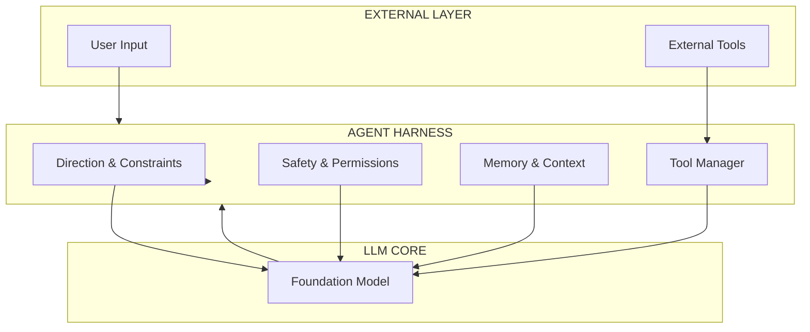
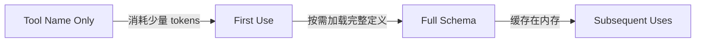
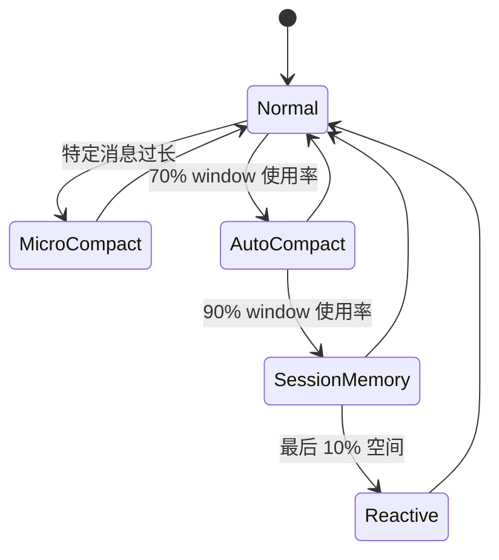
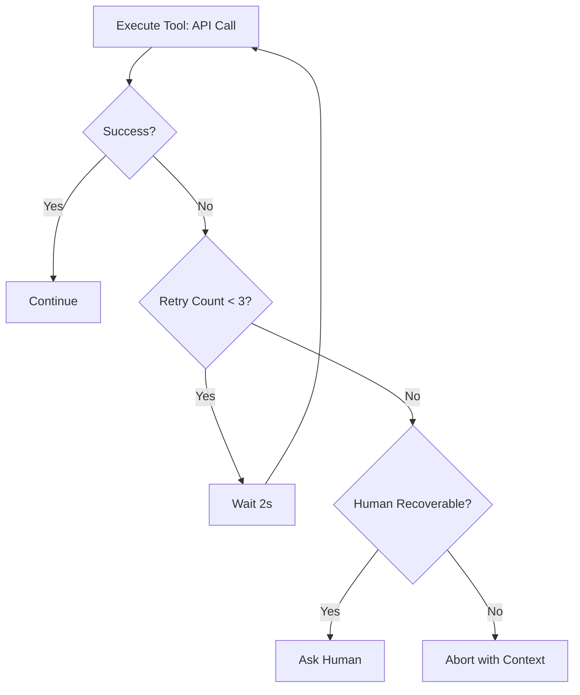
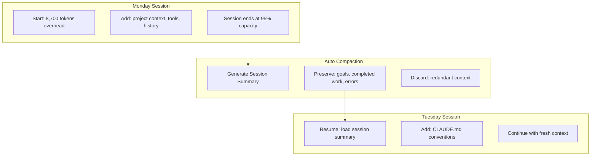
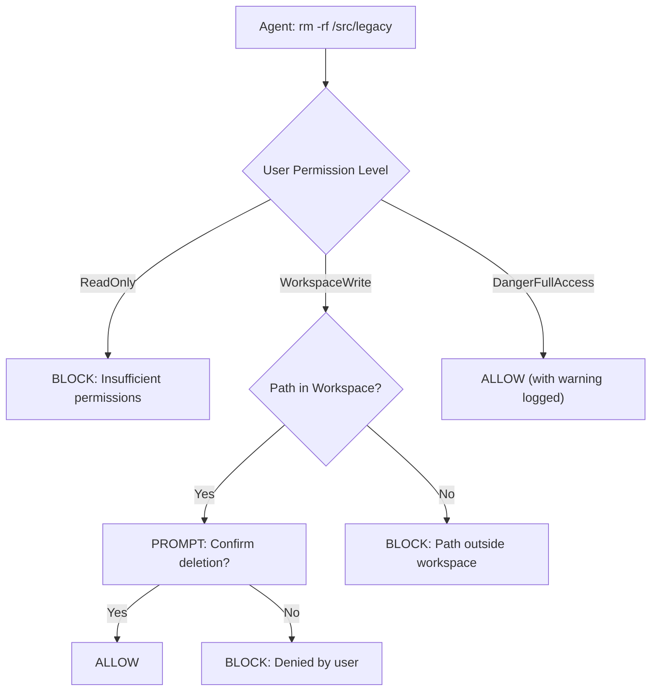
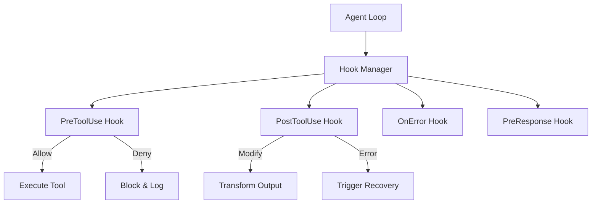
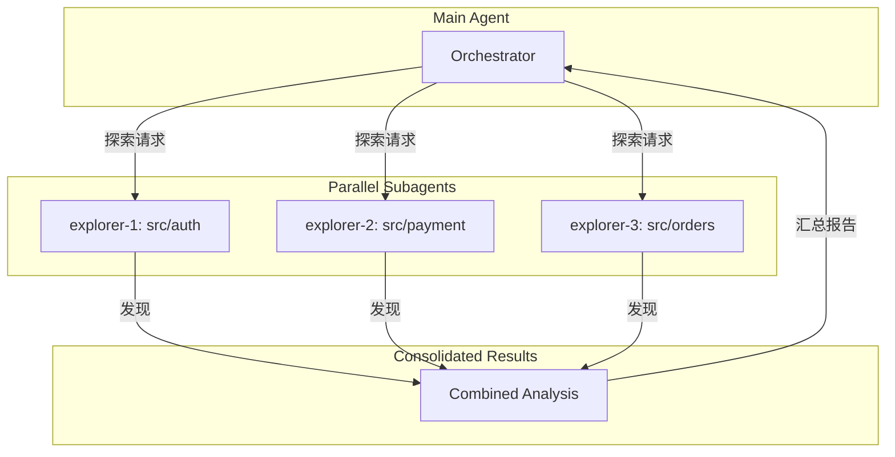
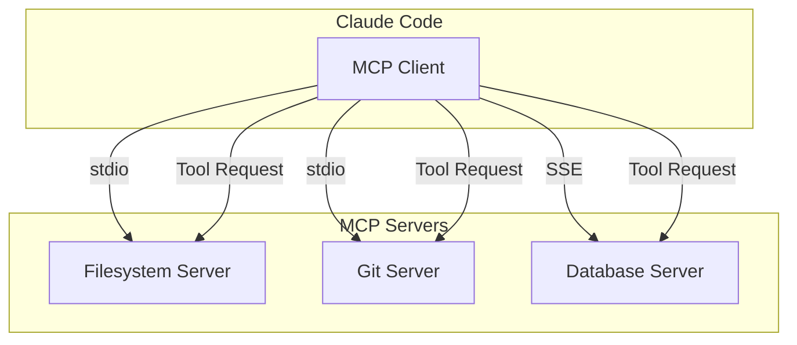

# Agent Harness 架构深度解析：AI Agent 系统的核心基础设施

> *Generated by AI | Date: 2026-04-02*
> *Source: https://contextua.dev/why-agent-harness-architecture-important/*

---

## 架构全景图



---

## 一、问题起源：为什么需要 Harness？

### 1.1 行业认知转变

2026 年，AI 行业经历了一次根本性认知转变：

| 时期 | 主流观点 | 实际结果 |
|------|----------|----------|
| 2024 | "模型即一切" | 70% 以上的 Agent 项目失败 |
| 2025 | "更大的模型 = 更好的 Agent" | 推理能力提升，但可靠性无显著改善 |
| 2026 | **"Agents aren't hard; the Harness is hard"** | OpenAI Codex 团队核心洞察 |

**架构师视角**：这条洞察揭示了一个深刻事实 —— AI Agent 的可靠性瓶颈不在于模型本身，而在于 **包裹模型的执行环境**。就像一台高性能发动机需要精密的变速箱和传动系统，强大的模型也需要精心设计的 harness 才能在复杂任务中可靠运行。

### 1.2 两个相同的模型，不同的结果

**场景：重构遗留代码库**

给两个相同的 GPT-4.5 模型相同的任务："重构这个 10 万行的遗留 Python 项目，采用领域驱动设计。"

- **Agent A**（无专业 harness）：产出 40% 可用代码，陷入死循环 3 次，产生 23 个冲突的修改
- **Agent B**（专业 harness）：产出 92% 可用代码，2 小时内完成，无冲突

**问题**：为什么同样的模型产生了截然不同的结果？

**答案**：Agent B 的 harness 提供了：
- 结构化的任务分解机制
- 上下文管理（避免陷入局部）
- 增量验证（每步检查）
- 状态回滚能力

---

## 二、Agent Harness 的定义与边界

### 2.1 什么是 Agent Harness？

**架构师视角**：如果把 AI 模型比作"大脑"，那么 Harness 就是这个大脑的"颅骨、神经系统和工作记忆"。它决定了模型如何感知、如何行动、如何保持一致性。

```
Agent Harness = 模型之外的一切
                = 意图捕捉 → 规范编译 → 执行 → 验证 → 持久化
```

### 2.2 Harness vs Prompt Engineering vs Context Engineering

| 维度 | Prompt Engineering | Context Engineering | Agent Harness |
|------|-------------------|-------------------|---------------|
| **关注点** | 提示词措辞 | 上下文内容选择 | 整个执行系统 |
| **层级** | 局部优化 | 上下文管理 | 系统架构 |
| **核心问题** | 怎么说 | 传什么 | 如何可靠运行 |
| **影响力** | 单次交互 | 单次会话 | 长期可靠性 |

**架构师视角**：这三个层次是包含关系。Prompt Engineering 是微观层面，Context Engineering 是中观层面，而 Agent Harness 是宏观架构层面。Harness Engineering 正是 2026 年兴起的新学科，它不是要取代前两者，而是为它们提供系统性的运行环境。

---

## 三、Agent Harness 的五大支柱

### 3.1 工具调用系统（Tool Calling System）

**架构师视角**：工具调用是 Agent 与外部世界交互的唯一通道。工具系统的设计直接影响 Agent 的能力边界和可靠性。

**核心问题**：
- 如何让模型知道有哪些工具可用？
- 如何保证工具调用的正确性？
- 如何处理工具执行失败？

**场景：代码重构任务**

```python
# 工具定义示例
ToolSpec {
    name: "read_file",
    description: "Read file contents with line numbers",
    input_schema: {
        "path": "string",
        "offset": "integer (optional)",
        "limit": "integer (optional)"
    },
    required_permission: "ReadOnly"
}

ToolSpec {
    name: "bash",
    description: "Execute shell command",
    input_schema: {
        "command": "string",
        "timeout": "integer (optional)"
    },
    required_permission: "DangerFullAccess"
}
```

**设计决策**：采用 **声明式工具规范** 而非运行时发现

- **权衡**：获得 X = 工具定义可预测、可版本化；付出 Y = 需要预定义所有工具
- **替代方案**：动态发现工具 —— 看似灵活，但导致不可预测性和安全风险

**Claude Code 的 Deferred Loading 机制**：



这意味着：
- 默认只传递工具名称，不传递完整 schema
- 首次使用时才加载完整定义
- 大幅减少 context 开销

### 3.2 上下文管理系统（Context Management System）

**架构师视角**：上下文是 Agent 的"工作记忆"。与人类的工作记忆一样，它容量有限，且需要主动管理才能保持效率。上下文管理的失败是 Agent 系统最常见的故障模式。

**核心问题**：
- 有限的 context window 如何支持无限的任务？
- 如何在压缩历史信息的同时保留关键状态？
- 如何在多轮交互中保持上下文连贯性？

**场景：为期一周的重构项目**

用户要求 Agent 完成一个大型重构任务，预计需要 5 天，涉及 200+ 轮交互。

**问题**：
- 第 1 天：context 累积了 50,000 tokens
- 第 3 天：context 达到 180,000 tokens（接近限制）
- 第 5 天：Agent 忘记了最初的目标和关键设计决策

**解决方案：四级压缩体系**



| 压缩层级 | 触发条件 | 压缩方式 | 用户感知 |
|----------|----------|----------|----------|
| **Micro-compact** | 单条消息 > 2KB | 手术式删除冗余 | 无 |
| **Auto-compact** | 70% window | 摘要 + 保留最近 | 无 |
| **Session-memory** | 90% window | 生成会话记忆 | 无 |
| **Reactive** | 最后 10% | 紧急压缩 | 可能卡顿 |

**架构师视角**：Claude Code 的四级压缩体系展示了一个关键原则 —— **压缩应该是渐进的、可配置的，而非突发性的**。最坏的设计是等到 context 满了才压缩，这会导致信息丢失和用户体验下降。

**Instant Compaction 模式**：

```python
# 后台线程主动构建会话记忆
background_status = "initializing" if self.session_memory is None else "updating"

def _create_session_memory(self, messages: list[dict]) -> str:
    # 当 soft threshold 达到时，后台生成摘要
    compaction_messages = [{"role": "user", "content": SESSION_MEMORY_PROMPT}]
    return model.generate(compaction_messages)
```

这使得压缩是**即时的**，用户永远不需要等待。

### 3.3 错误恢复系统（Error Recovery System）

**架构师视角**：错误恢复是区分"概念验证"和"生产系统"的关键。在 Agent 系统中，错误处理不仅仅是 try-catch，而是涉及整个执行流程的容错设计。

**核心问题**：
- 工具执行失败后 Agent 应该怎么做？
- 如何避免 Agent 在错误方向上越走越远？
- 何时应该回滚状态，何时应该继续尝试？

**场景：网络请求失败**



**关键设计：Checkpoint + Rollback**

```python
# 每个检查点保存状态快照
checkpoint = {
    "turn": 15,
    "context_summary": "已完成模块 A 和 B 的重构",
    "pending_changes": ["src/auth/*", "src/payment/*"],
    "verified_files": ["tests/test_a.py"]
}

# 失败时恢复到检查点
def rollback_to_checkpoint(checkpoint):
    restore_context_summary(checkpoint["context_summary"])
    discard_pending_changes()
    replay_verification(checkpoint["verified_files"])
```

**架构师视角**：Rollback 机制的核心洞察是 —— Agent 应该**保守地前进，激进地回退**。当不确定时，宁可回到已知的良好状态，也不要在错误的基础上继续构建。

### 3.4 状态持久化系统（State Persistence System）

**架构师视角**：真实世界的任务往往跨越多个会话。用户周一开始的重构任务，周五可能还需要继续。如果 Agent 每次启动都是"空白大脑"，生产效率将大幅下降。

**核心问题**：
- 如何在会话之间保持 Agent 状态？
- 如何处理长时间运行的任务？
- 如何支持会话的暂停和恢复？

**场景：跨会话的大型重构**

用户周一下午开始一个涉及 20 个微服务的重构，进行了 3 小时。周二早上回来继续工作。

**Claude Code 的持久化方案**：



**会话记忆的关键要素**：

```markdown
## Session Memory Template

### Completed Work
- 模块 A 的重构完成（周一）
- 测试覆盖率从 60% 提升到 85%

### Active Work
- 正在进行模块 B 的数据库迁移
- 遇到问题：外键约束冲突

### Key Decisions
- 采用事件溯源模式
- 使用 PostgreSQL 而非 MongoDB

### User Intent
- 本周目标：完成 20 个微服务的领域驱动设计重构
```

### 3.5 权限与安全系统（Permission & Safety System）

**架构师视角**：Agent 可以在真实环境中执行操作这一事实，使其成为一个潜在的风险系统。权限系统的设计必须在**可用性**和**安全性**之间找到精确的平衡 —— 过于严格会让 Agent 无法工作，过于宽松会造成灾难性后果。

**核心问题**：
- 如何防止 Agent 执行危险操作？
- 如何在效率和安全之间取得平衡？
- 如何让用户对 Agent 的行为保持信心？

**场景：执行删除操作**



**权限分级模型**：

```rust
pub enum PermissionMode {
    ReadOnly,           // 只能读取文件
    WorkspaceWrite,     // 可以在工作区写入
    DangerFullAccess,   // 可以执行任何操作（含危险命令）
    Prompt,             // 每次操作前询问
    Allow,              // 允许所有（不推荐）
}
```

**架构师视角**：最关键的设计决策是 **"默认拒绝，显式允许"** 原则。在安全系统中，永远不应该有"Allow All"作为默认选项。DangerFullAccess 应该是一个明确的、用户主动选择的模式，而不是默认状态。

---

## 四、Hook 系统：可扩展性的核心

### 4.1 Hook 架构设计

**架构师视角**：Hook 系统是 Agent Harness 的"插件机制"。它允许在不修改核心代码的情况下，改变 Agent 的行为。这是一种**控制反转（IoC）** 的实现 —— 不是 Agent 控制何时调用什么，而是 Harness 控制在何时、以何种方式干预 Agent 的执行。

**核心概念**：



### 4.2 Hook 的实际应用场景

**场景 1：自动代码检查**

```json
{
  "hooks": {
    "PreToolUse": [
      {
        "match": {"tool": "Bash"},
        "type": "command",
        "command": "echo 'Checking if tests pass before commit...'"
      }
    ],
    "PostToolUse": [
      {
        "match": {"tool": "Write", "path": "*.py"},
        "type": "command",
        "command": "ruff check {path} --fix"
      }
    ]
  }
}
```

**场景 2：架构合规检查**

```json
{
  "hooks": {
    "PreToolUse": [
      {
        "match": {"tool": "Edit", "path": "**/domain/*.py"},
        "type": "agent",
        "agent": "architect-review",
        "prompt": "Verify this edit follows DDD principles: {input}"
      }
    ]
  }
}
```

**架构师视角**：Hook 的强大之处在于它的**组合性**。通过组合 PreToolUse、PostToolUse、OnError 等多种 Hook，可以构建复杂的治理逻辑，而无需修改 Agent 本身。这与 Web 开发中的中间件模式有异曲同工之妙。

---

## 五、Subagent 与多代理系统

### 5.1 何时需要 Subagent？

**架构师视角**：Subagent 是解决"context 爆炸"问题的关键策略。当主 Agent 的 context 接近饱和时，将任务委托给 Subagent，让它在独立的上下文中工作，主 Agent 只保留协调者的角色。

**场景：大型代码库探索**



**关键设计原则**：

1. **隔离的上下文**：每个 Subagent 有自己的 context window
2. **共享的技能**：Subagent 可以访问主 Agent 的技能定义
3. **结构化通信**：Subagent 通过结构化格式返回结果
4. **缓存优化**：共享的 system prompt 只需要加载一次

### 5.2 Agent Spawning 架构

```python
# Subagent 配置
AgentConfig {
    description: "Architecture Reviewer",
    prompt: "You are an architecture expert...",
    tools: ["Read", "Grep", "Glob", "Agent"],
    disallowed_tools: ["Bash", "Write"],
    model: "claude-sonnet-4-20250514",
    permission_mode: "ReadOnly",
    max_turns: 20
}
```

**架构师视角**：Subagent 的设计揭示了一个重要的系统设计原则 —— **任务分解 + 独立执行 + 结果聚合**。这与函数式编程中的 map-reduce 模式有相似之处。关键的权衡是：

- **获得**：水平扩展能力，独立处理多个任务
- **付出**：协调复杂性，结果聚合可能丢失信息

---

## 六、主流 Agent 的 Harness 实现对比

| 特性 | Claude Code | Cursor | SWE-Agent | Devin |
|------|-------------|--------|-----------|-------|
| **语言** | TypeScript | TypeScript | Python | ? |
| **工具调用** | Deferred Loading | Eager Loading | Eager Loading | ? |
| **上下文压缩** | 四级自动压缩 | 基础压缩 | 简单截断 | ? |
| **权限模型** | 五级权限 | 固定模式 | 无 | ? |
| **Hook 系统** | 完整支持 | 部分支持 | 无 | ? |
| **Subagent** | 原生支持 | 通过 Composer | 支持 | ? |
| **MCP 支持** | 原生支持 | 插件支持 | 无 | ? |
| **会话持久化** | Session Memory | Project Memory | 无 | ? |

**架构师视角**：从对比可以看出，Claude Code 在 Harness 层面提供了最完整的设计。这不是偶然的 —— 它反映了 Anthropic 对 Agent 系统可靠性的深刻理解。特别是 **deferred tool loading** 和 **四级压缩体系**，是其他系统尚未充分解决的难题。

---

## 七、MCP：工具发现的标准化

### 7.1 为什么需要 MCP？

**架构师视角**：MCP（Model Context Protocol）的出现解决了一个根本性问题 —— **AI 模型与工具之间缺乏标准化的连接协议**。在没有 MCP 之前，每个 Agent 系统都需要为每个工具编写定制化的集成代码，导致：

- 工具不可移植
- 集成成本高昂
- 安全模型不一致

### 7.2 MCP 架构



**MCP 服务器配置示例**：

```json
{
  "mcpServers": {
    "filesystem": {
      "type": "stdio",
      "command": "npx",
      "args": ["@modelcontextprotocol/server-filesystem", "/path/to/allowed"]
    },
    "git": {
      "type": "stdio",
      "command": "uvx",
      "args": ["mcp-server-git"]
    },
    "remote-api": {
      "type": "sse",
      "url": "https://api.example.com/mcp"
    }
  }
}
```

---

## 八、设计模式总结

### 8.1 核心设计模式

| 模式 | 描述 | 应用场景 |
|------|------|----------|
| **Generator-based Loop** | 使用生成器实现 Agent 循环 | 状态机管理 |
| **Progressive Compaction** | 渐进式上下文压缩 | 长任务支持 |
| **Fork for Cache** | Subagent 共享 prompt cache | 多任务并行 |
| **Deferred Loading** | 延迟加载非必要资源 | 减少 context 开销 |
| **Permission Pipeline** | 权限检查管道 | 安全控制 |
| **Hook-based Extensibility** | 基于 Hook 的扩展 | 行为定制 |
| **Immutable State** | 不可变状态设计 | 可回滚性 |
| **Scratchpad Filesystem** | Agent 知识持久化 | 跨会话记忆 |

### 8.2 每个模式的权衡

**Progressive Compaction vs Full Summarization**：

- **Progressive**：计算成本高，但信息保留更完整
- **Full**：计算成本低，但可能丢失细节

**Deferred Loading vs Eager Loading**：

- **Deferred**：初始 context 小，但首次工具使用有延迟
- **Eager**：无首次使用延迟，但初始 context 大

**Permission Pipeline vs Single Check**：

- **Pipeline**：更安全，但性能略低
- **Single**：更快，但安全性较低

---

## 九、未来展望

### 9.1 当前瓶颈

1. **Context 仍然有限**：200K tokens 对于真正的长时间任务仍然不够
2. **压缩仍有信息丢失**：即使是最好的压缩也会丢失细节
3. **多代理协调困难**：Subagent 之间的通信仍然脆弱
4. **安全边界模糊**：Hook 系统可能被恶意利用

### 9.2 未来方向

| 方向 | 关键技术 | 预期效果 |
|------|----------|----------|
| **外部推理引擎** | 知识图谱 + LLM | 减少 context 负担 |
| **持久化记忆网络** | 向量数据库 + 结构化存储 | 真正的长期记忆 |
| **自适应压缩** | 基于重要性的压缩 | 更少信息丢失 |
| **标准化协议** | MCP 普及 | 工具生态繁荣 |

---

## 总结

Agent Harness 是 2026 年 AI Agent 系统的核心基础设施。它不是一个单一的技术组件，而是由五大支柱组成的复杂系统：

1. **工具调用系统** — Agent 与世界交互的通道
2. **上下文管理系统** — 有限资源下的高效利用
3. **错误恢复系统** — 生产环境必需的可靠性保障
4. **状态持久化系统** — 跨会话的连续性
5. **权限与安全系统** — 防止灾难性后果

**关键洞察**：

- "Agents aren't hard; the Harness is hard" — OpenAI Codex 团队
- 模型是引擎，Harness 是变速箱和传动系统
- 可靠性瓶颈不在于模型能力，而在于执行环境

**实践建议**：

1. 构建 Agent 系统时，先设计 Harness，再选择模型
2. 采用渐进式压缩，而非等到 context 满了才处理
3. 实现 Hook 系统，为未来的扩展预留空间
4. 采用"默认拒绝"的权限模型
5. 利用 MCP 标准化工具集成

---

*参考资料：*
- *[ContextUA: Why Agent Harness Architecture is Important](https://contextua.dev/why-agent-harness-architecture-important/)*
- *[NxCode: Harness Engineering Complete Guide 2026](https://www.nxcode.io/resources/news/what-is-harness-engineering-complete-guide-2026)*
- *[Epsilla: Why Harness Engineering Replaced Prompting in 2026](https://www.epsilla.com/blogs/harness-engineering-evolution-prompt-context-autonomous-agents)*
- *[Claude Code Official Documentation](https://code.claude.com/docs)*
- *[Penligent: Inside Claude Code Architecture](https://www.penligent.ai/hackinglabs/inside-claude-code-the-architecture-behind-tools-memory-hooks-and-mcp/)*
- *[OpenAI: Harness Engineering](https://openai.com/index/harness-engineering/)*
